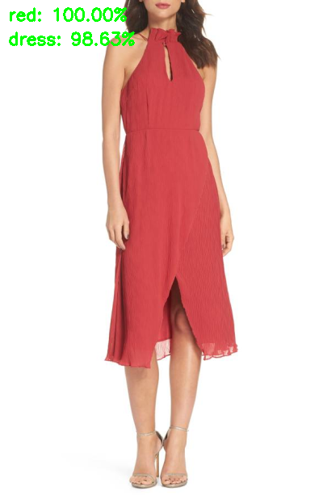
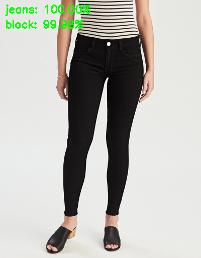

A simple Image Classification model classifies image into a single label like dog, cat, vehicle, person etc.

But an image may have more that 1 features and hence can be classified into multiple labels, with each label having multiple classes.

Hence we use a multi-label classification model.

Here we classify the fashion items dataset into 2 labels- color and the type of fashion item.
The model can be extended for more labels, like the gender or the cloth material.

It can be used for recommending similar products based on the labels obtained.  

The model uses a single Convolution Neural Network to classify images.
The biggest difference between a single label and a multi label classification is the use of sigmoid function instead of softmax functionin the last layer.

